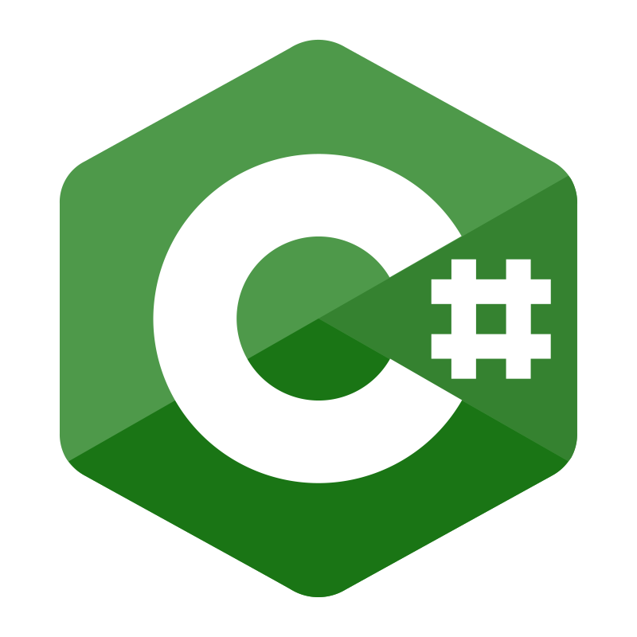
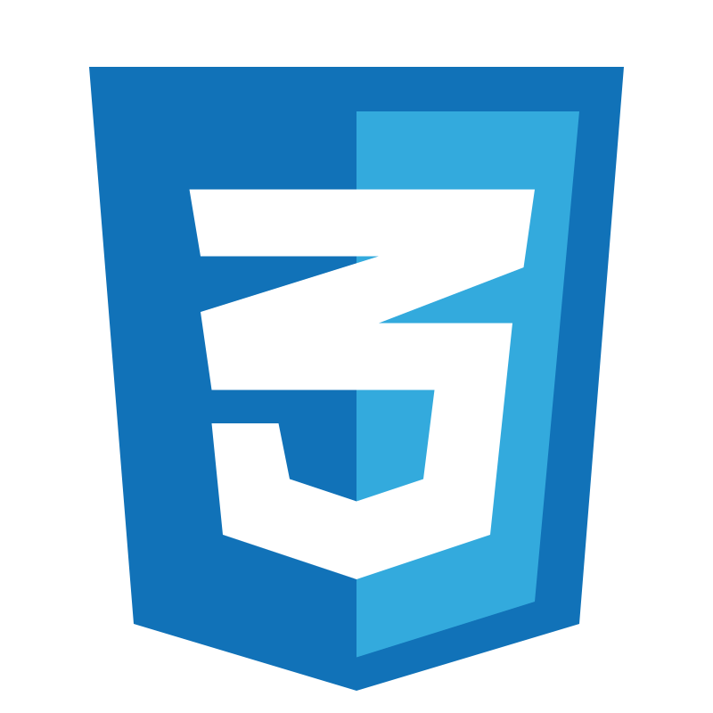
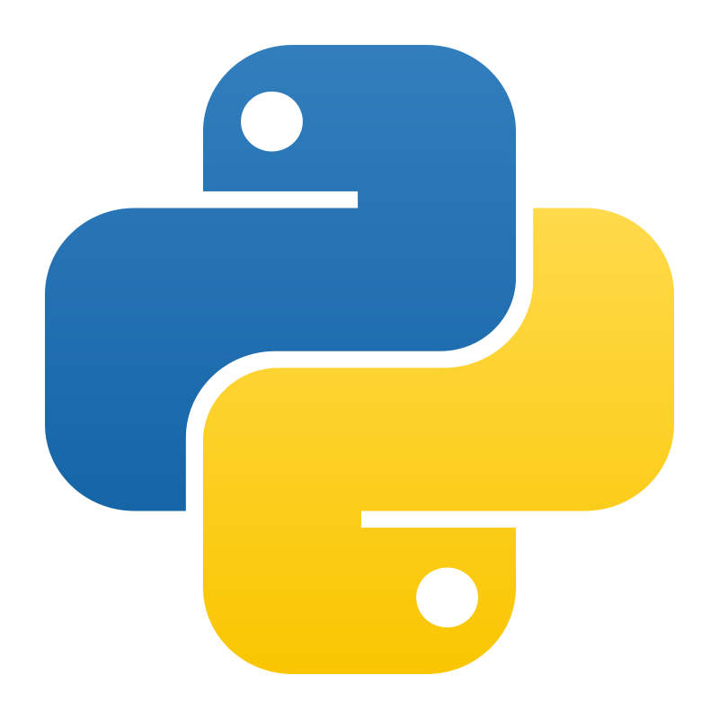
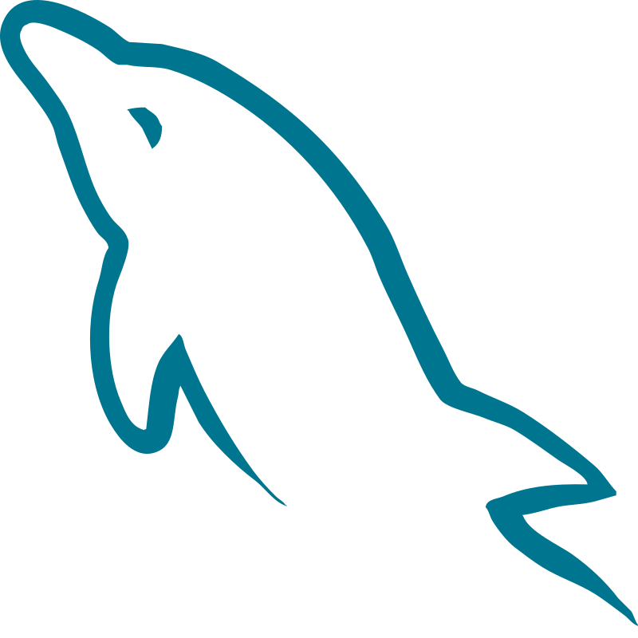
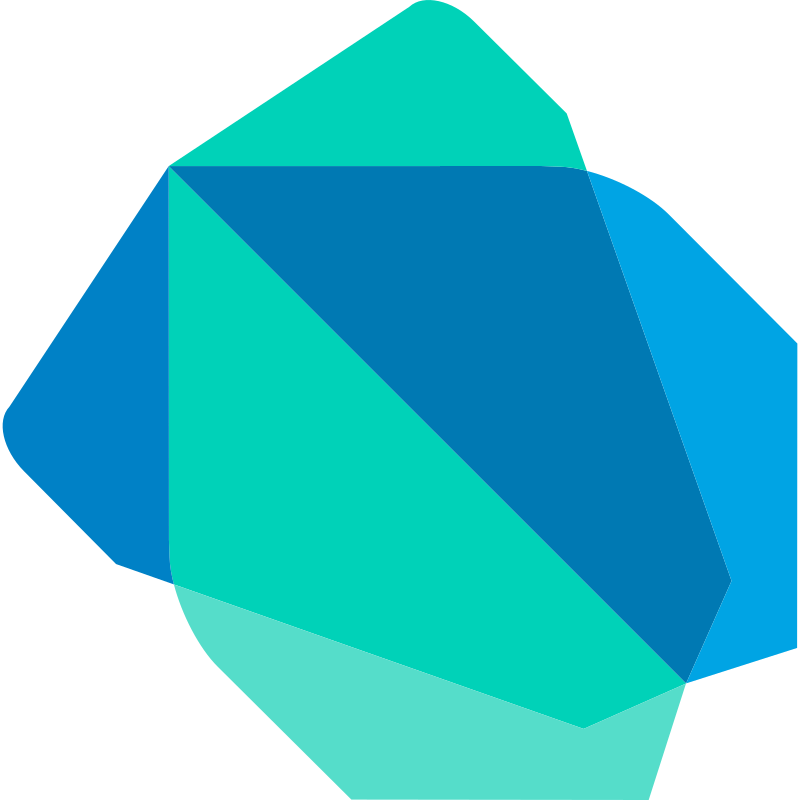
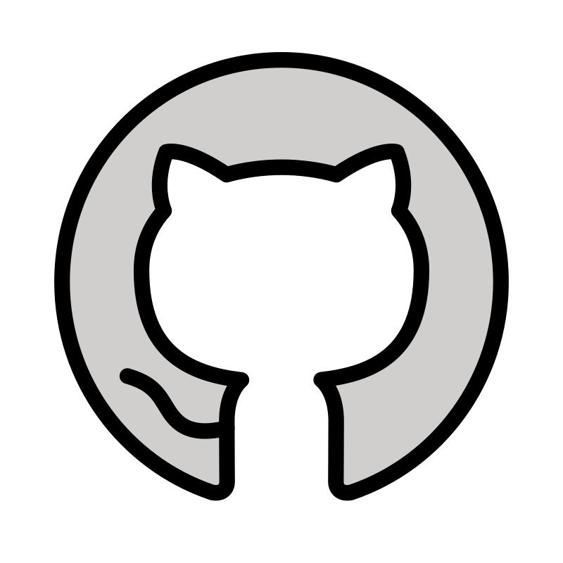
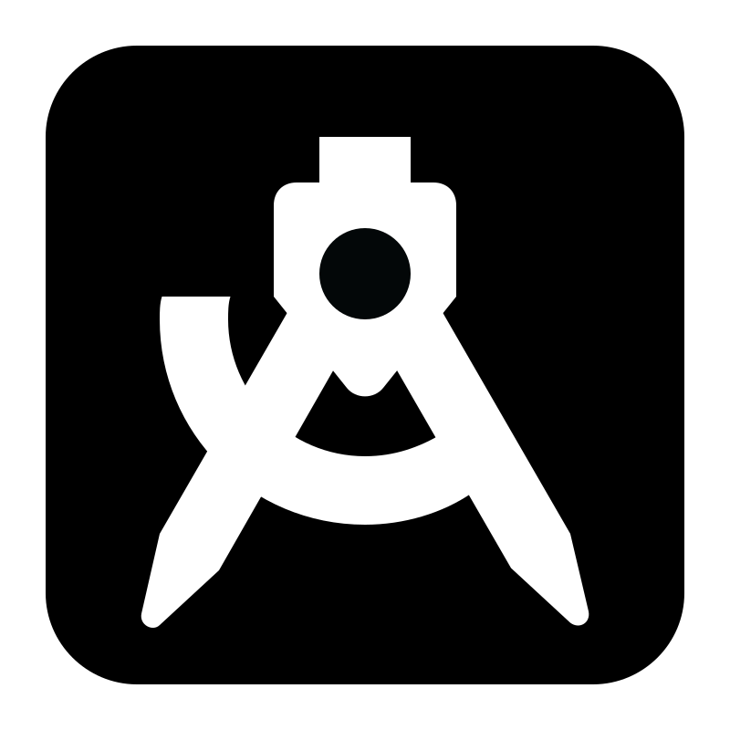
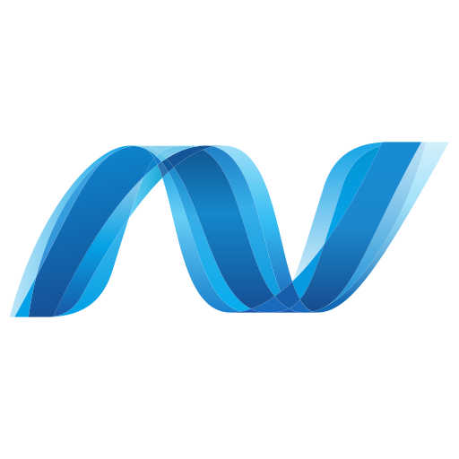

# 👋 Hello !! I'm Baptiste

I am passionate about programming and currently a post–common core student at 42 School. Through my projects and training, I have developed a solid foundation in software development and problem-solving. I enjoy working on technical challenges and continuously improving my programming skills. I am currently looking for a work-study opportunity (alternance) as a Data Scientist, Data Analyst, or in application development, where I can apply my knowledge, learn from experienced professionals, and contribute to real-world projects.

---

# 💻 Tech Stack :

  
  
  
  
  
  
  
  
  
  

---

# 🛠️ Tools :

  
  
  
  
  
  
  
  

---

# 📫 Contact :

  
    
  
  

